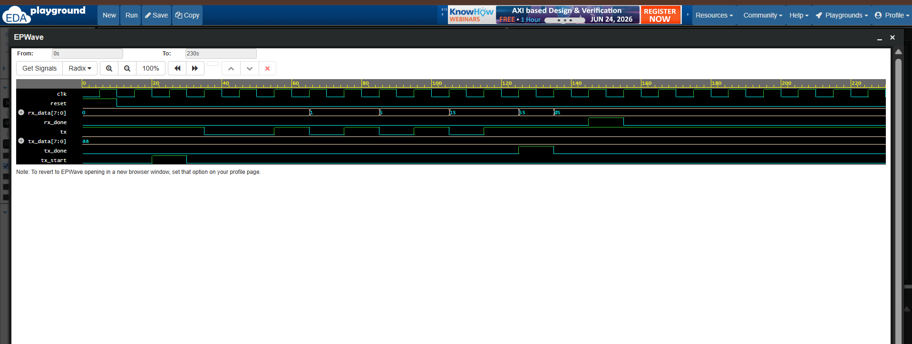

# 📡🔄 Complete UART Communication System using Verilog HDL

> 🚀 An integrated UART communication system designed using Verilog HDL by combining UART Transmitter (TX) and UART Receiver (RX) modules.

---

## 📖 Overview

UART (Universal Asynchronous Receiver Transmitter) is one of the most widely used serial communication protocols in embedded systems and FPGA applications.

This project demonstrates a complete UART communication system where transmitted serial data is successfully received and reconstructed using FSM-based UART TX and UART RX modules.

---

## ✨ Features

✅ UART Transmitter (TX)

✅ UART Receiver (RX)

✅ FSM-Based Design

✅ 1 Start Bit

✅ 8 Data Bits (LSB First)

✅ 1 Stop Bit

✅ Transmission Complete Signal (`tx_done`)

✅ Reception Complete Signal (`rx_done`)

✅ End-to-End Communication Verification

✅ Testbench Simulation

✅ EPWave Waveform Analysis

---

# 📂 Repository Structure

```text
Verilog-UART-System/
│
├── uart_tx.v
├── uart_rx.v
├── uart_system_tb.v
├── uart_system_waveform.png
└── README.md
```

---

# 📡 UART Communication Flow

```text
Parallel Data
     ↓
UART TX
     ↓
Serial Transmission
     ↓
UART RX
     ↓
Recovered Parallel Data
```

---

# 🏗️ System Architecture

```text
        +-------------+       tx_line       +-------------+
        |  UART TX    |-------------------->|  UART RX    |
        +-------------+                     +-------------+

            tx_data                           rx_data
```

---

# 📥 Inputs

| Signal | Width | Description |
|----------|--------|-------------|
| clk | 1-bit | System Clock |
| reset | 1-bit | Asynchronous Reset |
| tx_start | 1-bit | Initiates Transmission |
| tx_data | 8-bit | Data to be Transmitted |

---

# 📤 Outputs

| Signal | Width | Description |
|----------|--------|-------------|
| tx | 1-bit | Serial Output Line |
| tx_done | 1-bit | Transmission Complete |
| rx_data | 8-bit | Received Data |
| rx_done | 1-bit | Reception Complete |

---

# 🚦 UART Frame Format

```text
| Start | D0 | D1 | D2 | D3 | D4 | D5 | D6 | D7 | Stop |
|   0   |          8 Data Bits          |   1   |
```

### Note

UART transmits and receives data **LSB (Least Significant Bit) First**.

---

# 🧪 Test Case

Input Data:

```text
tx_data = 10101010
```

Expected Flow:

```text
TX → Start → 0 → 1 → 0 → 1 → 0 → 1 → 0 → 1 → Stop
```

Expected Result:

```text
rx_data = 10101010
```

---

# 📷 Simulation Waveform

The waveform below verifies successful UART communication between the transmitter and receiver.



---

# 🛠️ Tools Used

💻 Verilog HDL

🧪 EDA Playground

📈 EPWave

🌐 GitHub

---

# 🎯 Learning Outcomes

Through this project, I gained practical experience in:

🔹 UART Communication Protocols

🔹 FSM-Based System Design

🔹 Module Integration

🔹 Serial Data Transmission

🔹 Serial Data Reception

🔹 End-to-End Verification

🔹 Testbench Development

🔹 Functional Debugging

🔹 Waveform Analysis

---

# 🚀 Future Enhancements

This UART system can be extended by adding:

📡 Baud Rate Generator

🖥️ FPGA Implementation

🔄 Full-Duplex UART Communication

📨 FIFO Buffers

⚡ Interrupt Support

---

# 👩‍💻 Author

**Aneesa Pattan**

Electronics and Communication Engineering (ECE) Student

Aspiring VLSI & RTL Design Engineer 🚀

---

## ⭐ If you found this project interesting, consider starring the repository!

> *"Building complete systems transforms individual concepts into real engineering solutions."* 📡✨
